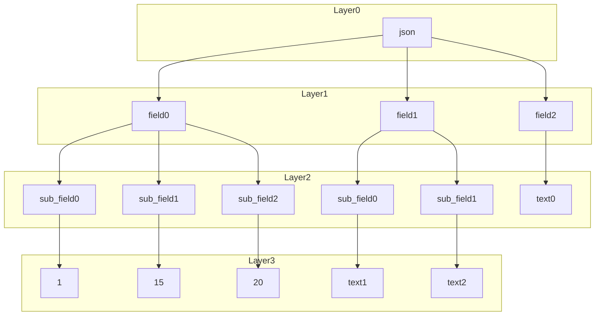

# Описание
ExcelToJsonUniversalParser - это утили для парсинга excel-файлов в текст json-формата с поддержкой неограниченной вложенности объектов json. Утилита написана на языке python.

Особенности:
- Поддерживает парсинг многоуровневой вложенности объектов в json файлах;
- Семантика парсинга настраивается прямо в excel-файле;
- Не требует изменения кода при объявлении новых типов;

Способы применения:
- Массовая выгрузка данных в формате json (актуально для gamedev);

## Оглавление
* [Установка](#prepare)
  * [Автоматизированная установка](#auto-mode-install)
  * [Ручная установка](#hand-mode-install)
* [Запуск процесса парсинга](#run)
  * [Автоматизированное выполнение](#auto-mode-run)
  * [Ручное выполнение](#hand-mode-run)
* [Настройка парсера (`Example\Config.json`)](#config-setup)
* [Правила заполнения Excel-файла для парсинга](#excel-configuration-rules)
* [Рекомендации по заполнению Excel-файла](#lifehack)


<a name="prepare"></a>
## Установка

Для использования требуется выкачать репозиторий и установить дополнительные модули.

Установку можно произвести в автоматизированном и ручном режимах.

<a name="auto-mode-install"></a>
<details>
<summary>Автоматизированная установка</summary>

Автоматизированная установка выполняет все пункту из установки в [ручном режиме](#handModeInstall). 
Автоматизированная установка выполняется через скрипт в PowerShell.

В выкаченном репозитории найти файл `Install.ps1` и запустить через PowerShell (ПКМ -> Запустить через PowerShell)
Файл делает следующее:
- устанавливает pyenv
- устанавливает python ver. 3.7.4
- устанавливает Pip
- устанавливает pandas ver. 1.3.5
- устанавливает openpyxl ver 3.1.3
- добавляет Envarament variables (на время сессии терминала PowerShell)

В случае возникновения ошибки `... .ps1 cannot be loaded because running scripts is disabled on this system. ...` запустить скрипт `FixInstallPyenv.ps1` в PowerShell, после чего повторить запуск  `Install.ps1`.
 
</details>

<details>

 <a name="hand-mode-install"></a>
<summary>Ручная установка</summary>

Установка pyenv [Рекомендуется]:

Сайт разработчика `https://github.com/pyenv-win/pyenv-win?tab=readme-ov-file#installation`

Windows (Выполнить в PowerShell): 

```
Invoke-WebRequest -UseBasicParsing -Uri "https://raw.githubusercontent.com/pyenv-win/pyenv-win/master/pyenv-win/install-pyenv-win.ps1" -OutFile <путь сохранения файла install-pyenv-win.ps1>; &<путь к сохранённому файлу install-pyenv-win.ps1>;
```
В случае возникновения ошибки `... .ps1 cannot be loaded because running scripts is disabled on this system. ...` выполнить
```
Set-ExecutionPolicy -ExecutionPolicy RemoteSigned -Scope CurrentUser
```
Установить Path EvarementVariables.
`Поиск` -> `Изменение системных переменных среды` -> `Переменные среды…` -> Раздел `Переменные среды пользователя`, выбрать `Path` -> `Изменить` -> выполнить добавление путей
```
C:\Users\<replace with your actual username>\.pyenv\pyenv-win\bin
C:\Users\<replace with your actual username>\.pyenv\pyenv-win\shims
```

Установка Python и модулей

Windows (Выполнить в PowerShell):

```
pyenv install 3.7.4
```
```
pyenv global 3.7.4
```
```
pip install pandas==1.3.5
```
```
pip install openpyxl==3.1.3
```
Проверка
	
```
pyenv version
```
`вывод: 3.7.4 (set by C:\Users\<user-name>\.pyenv\pyenv-win\version)`
</details>

<a name="run"></a>
## Запуск процесса парсинга

1. Настроить `"<вставить путь до репозитория>\Parser\Example\Config.json"` (см. раздел [`Настройка парсера`](#config-setup)).
1. Положить excel-файл по пути указанному в `Config.json` (поле `"excelFilePath"`).
1. Выполнить парсинг в автоматизированном или ручном режиме.

<a name="auto-mode-run"></a>
<details>
<summary>Автоматизированное выполнение</summary>

В выкаченном репозитории найти файл `RunParse.ps1` и запустить через PowerShell (ПКМ -> Запустить через PowerShell)

Скрипт делает следующее: 
- добавляет Envarament variables (на время сессии терминала PowerShell)
- запускает python скрипт парсинга

</details>

<a name="hand-mode-run"></a>
<details>
<summary>Ручное выполнение</summary>
1. Переключиться в папку с проектом

RunParse.ps1

Windows (Выполнить в PowerShell):

```
cd "<вставить путь до репозитория>\Parser\PythonScripts\"
```
4. Выполнить запуск
Windows (Выполнить в PowerShell):
```
python .\main.py --config_path <путь до файла Config.json>
```
</details>
<br>
<br>


Если всё прошло успешно, то будет выведено `Done!`

Результат находится по пути, указанному в Config.json для каждой фичи отдельно (`parsingFeatures-> outputDirectory/outputFileName`)

<a name="config-setup"></a>
# Настройка парсера (`Example\Config.json`)
Файл настройки находится по пути `<вставить путь до репозитория>\Parser\Example\Config.json`
В `Config.json` находятся параметры, на основе которых осуществляется парсинг excel-документа.
Что необходимо настроить:

```
excelFilePath - это путь где искать Excel-файл, который будет парситься. Путь указывать относительно main.py.
parsingFeatures - это список фичей, который нужно спарсить из excel-файла.
		Фичи можно указывать не все (лишние скрипт проигнорирует)	
Для каждой фичи нужно настроить:
	excelSheetName - название страницы в excel-файле
	featureName - название фичи (должно совпадать с именем в колонках excel-файле).
	outputDirectory - это путь куда будет сохранён итоговый json-файл.  Путь указывать относительно main.py.
	outputFileName - имя файла итогового json-файл
```

FAQ:
1. Для `outputDirectory` можно использовать относительный путь, чтобы сразу разместить файл там где нужно (`../../TargetPath`)
1. Название фичей featureName не должно повторяться
1. Фичи можно размещать на разных страницах excel-документа (главное правильно указать "excelSheetName")
1. В `Config.json` можно переопределить откуда скрипт будет брать значения (поле `parsingExcel`).
   1. Поле `fieldsSeparator` описывает каким знаком будут разделены уровни в excel-файлеы

<a name="excel-configuration-rules"></a>
# Правила заполнения Excel-файла для парсинга
Для того чтобы скрипт успешно выполнил свою работу необходимо корректно заполнить excel документ со всеми правилами и ограничениями. 

<details>	
<summary>Теория. Json - структура в виде дерева</summary>


Json-файл можно представить в виде дерева. На каждом уровне вложенности `LayerN` могут быть любые поля



Для преобразования excel-файла в json необходимо перебрать все ветви деревьев, где в итоге будет получен полный путь с учётом вложенности и значением. 
```
json-field0-sub_field0: 0
json-field0-sub_field1: 1
...
json-field1-sub_field2: text2
...
json-field2 : value
```

Полученные пути полей и значения можно представить в виде таблицы.
  <root_field_names> | sub_field_name     | value
---------------------|--------------------|-------
json-field0-sub_field0 |		string	  | 0
json-field0-sub_field1| number | 1
||
json-field1-sub_field2 | string | text2
||
json-field2 | string | value

</details>

Для парсинга в Json используются три типа значений

1. Поле со значением
1. Объект
1. Массив

<details>
<summary>Тип "Поле со значением"</summary>
	
Является строкой, где ключу соответствует определённое значение `<key>:<value>`
	
Для парсинга существует 4 формата данных
1. `$str` - строка. Значение представлено в виде текста и в файле json оборачивается в кавычки
1. `$num` - число. Значение представлено в виде числа (целого или дробного), записывается без кавычек
1. `$null` - отсутствие значения
1. `$bool` - логическое значение символизирующее "да" или "нет". Значения могут быть `true` или `false`
	
Эти три типа операции являются конечными узлами в дереве json.

В Excel запись должна выглядеть следующим образом:
  <root_field_names> | sub_field_name     | value
---------------------|--------------------|-------
feauture_name-field0 |		$str	  | 0
feauture_name-field1 |		$num	  | 123
feauture_name-field2 |		$null	  |
feauture_name-field3 |		$bool	  | true


Приведённый пример будет преобразован в:
```
{
	"field0": "0",
	"field1": 123,
	"field2": null,
	"field3": true
}
```
feauture_name - является самым верхним уровнем. На основе этого значения происходит группировка строк.

Поля со значением могут быть частью объектов и массивов.
</details>

<details>
<summary>Тип "Объект"</summary>

Является списком полей, обёрнутых фигурными скобочками.
Ниже представлен пример, где поле `fieldX` является объектом
```
{
	"fieldX": 
	{
		"field0": "0",
		"field1": 123,
		"field2": null,
		"field3": true,
	}
}
```

Парсинг осуществляется по уровням. Каждый вложенный элемент - это новый уровень.
Уровни с объектами необходимо помечать разделителями `$ld` (сокращение от layer delimiter). 
В качестве value для значения `$ld` подставляется открывающаяся фигурная скобочка `{`

При переходе от уровня к уровню необходимо сначала описать что находиться на данном уровне, а только потом подставлять значения. 
Пример выше в виде подготовленных данных для парсинга из excel
<root_field_names> | sub_field_name | value
-------------------|----------------|----------------
feauture_name |	  $ld   	 | {
feauture_name |	  fieldX 	 	 |
||	
feauture_name-fieldX |	  $ld   	 | {
feauture_name-fieldX |	 field0 	 |
feauture_name-fieldX |	 field1 	 |
feauture_name-fieldX |	 field2 	 |
feauture_name-fieldX |	 field3 	 |
||
feauture_name-fieldX-field0 |$str  	 | 0
feauture_name-fieldX-field1 |$num  	 | 123
feauture_name-fieldX-field2 |$null 	 |
feauture_name-fieldX-field3 |$bool	 | true

</details>

<details>
<summary>Тип "Массив"</summary>

Представляет из себя список объектов или полей со значением.
Как и объект требует разметки для уровня `$ld`. 
В качестве value для значения `$ld` подставляется прямоугольная скобочка `[`
	
Массив задаётся в три уровня.
- Уровень 0: необходимо указать разделитель уровня `$ld` и специальный оператор массива `$arr`.
- Уровень 1: необходимо перечислить `id` элементов массива.
- Уровень 2: описываются сами элементы массива.
	
Пример json с массивом, где элементы являются объектами

```
{
	"fieldY":
	[
		{
			"field0": "a0",
			"field1": "a1"
		},
		{
			"field0": "b0",
			"field1": "b1"
		}
	]
}
```

Пример выше в виде подготовленных данных для парсинга в excel

<root_field_names>| sub_field_name | value
------------------|----------------|--------
 feauture_name|$ld	   | {
 feauture_name|fieldY    |
||
feauture_name-fieldY|$ld	   | [
feauture_name-fieldY|$arr	   |
||
feauture_name-fieldY-$arr|0	   |
feauture_name-fieldY-$arr|1	   |
||
feauture_name-fieldY-$arr-0|$ld	   | {
feauture_name-fieldY-$arr-0|field0    |
feauture_name-fieldY-$arr-0|field1    |
||		   
feauture_name-fieldY-$arr-1|$ld	   | {
feauture_name-fieldY-$arr-1|field0    |
feauture_name-fieldY-$arr-1|field1    |
||
feauture_name-fieldY-$arr-0-field0|	 $str	   | a0
feauture_name-fieldY-$arr-0-field1|$str	   | a1
||
feauture_name-fieldY-$arr-1-field0|$str	   | b0
feauture_name-fieldY-$arr-1-field1|$str	   | b1

</details>

В папке `Example` находится excel-документ `Doc.xlsx` с демонстрацией настройки.
В excel-файле заполнены данные для 3-х фич:
- `feauture_name` (описываемый пример)
- `season`
- `season1`

В `<вставить путь до репозитория>\Parser\Example\Config.json` указан список какие из этих фичей парсить и куда положить json-файл. По умолчанию файлы появятся рядом с `Doc.xlsx` в папке `Temp`.
По умолчанию фича `season1` отключена для парсинга (не указана в списке `parsingFeatures`)

# Пример структуры файла
<details>
<summary>Json структура</summary>
	
```
[
    "$type": "TestType",
    "field1": 1,
    "field2":
    {
        "$type": "TestType1",
        "sub_field1": "test_type1_value",
        "sub_field2": 2
    },
    "field3":
    {
        "sub_field1":
        {
            "value": "TestType3",
            "value2": "values_values"
        }
    },
    "field4":
    [
        "0_value",
        "1_value",
        "2_value"
    ],
    "field5":
    [
        {
            "field5_0_1": "value_field5_1",
            "field5_0_2": "value_field5_2"
        },
        {
            "field5_1_0": "value_field5_1"
        },
        {
            "field5_1_0": "value_field5_1"
        }
    ],
    "field6":
    [
    ],
    "field7":
    [
        [
        ],
        [
        ]
    ],
    "field8":
    {
    },
    "field9": null,
    "field10":
    [
        {
            "field1": "12345"
        },
        null,
        {
            "field1": "12345"
        }
    ],
    "field11": false
]

```
</details>

<details>
<summary>Excel структура</summary>

<root_field_names>| sub_field_name | value
------------------|----------------|--------
season|$ld|[|
season|$type|
season|field1|
season|field2|
season|field3|
season|field4|
season|field5|
season|field6|
season|field7|
season|field8|
season|field9|
season|field10|
||
season-$type|$str|TestType|
season-field1|$num|1|
||
season-field2|$ld|{|
season-field2|$type|
season-field2|sub_field1|
season-field2|sub_field2|
season-field2-$type|$str|TestType1|
season-field2-sub_field1|$str|test_type1_value|
season-field2-sub_field2|$num|2|
||
season-field3|$ld|{|
season-field3|sub_field1|
season-field3-sub_field1|$ld|{|
season-field3-sub_field1|value|
season-field3-sub_field1|value2|
season-field3-sub_field1-value|$str|TestType3|
season-field3-sub_field1-value2|$str|values_values|
||
season-field4|$ld|[|
season-field4|$arr|
season-field4-$arr|0|
season-field4-$arr|1|
season-field4-$arr|2|
season-field4-$arr-0|$str|0_value|
season-field4-$arr-1|$str|1_value|
season-field4-$arr-2|$str|2_value|
||
season-field5|$ld|[|
season-field5|$arr|
season-field5-$arr|0|
season-field5-$arr|1|
season-field5-$arr|2|
||
season-field5-$arr-0|$ld|{|
season-field5-$arr-0|field5_0_1|
season-field5-$arr-0|field5_0_2|
season-field5-$arr-0-field5_0_1|$str|value_field5_1|
season-field5-$arr-0-field5_0_2|$str|value_field5_2|
||
season-field5-$arr-1|$ld|{|
season-field5-$arr-1|field5_1_0|
season-field5-$arr-1-field5_1_0|$str|value_field5_1|
||
season-field5-$arr-2|$ld|{|
season-field5-$arr-2|field5_1_0|
season-field5-$arr-2-field5_1_0|$str|value_field5_1|
||
season-field6|$ld|[|
season-field6|$arr|
||
season-field7|$ld|[|
season-field7|$arr|
||
season-field7-$arr|$ld|[|
season-field7-$arr|0|
season-field7-$arr|1|
||
season-field7-$arr-0|$ld|[|
season-field7-$arr-0|$arr|
||
season-field7-$arr-1|$ld|[|
season-field7-$arr-1|$arr|
||
season-field8|$ld|{|
||
season-field9|$null|
||
season-field10|$ld|[|
season-field10|$arr|
||
season-field10-$arr|1|
season-field10-$arr|2|
season-field10-$arr|3|
||
season-field10-$arr-1|$ld|{|
season-field10-$arr-1|field1|
||
season-field10-$arr-1-field1|$str|12345|
||
season-field10-$arr-2|$null|
||
season-field10-$arr-3|$ld|{|
season-field10-$arr-3|field1|
||
season-field10-$arr-3-field1|$str|12345|
||
season-field11|$bool|false|


</details>


<a name="lifehack"></a>
## Рекомендации по заполнению Excel-файла
1. Формирование полей в excel стоит сделать автоматизированного через `Concatinate()`/`Join()`.
	Это позволит легко менять названия и перепривязывать цепочки полей
2. Если фича большая, а нужно проверить правильность её вывода, то можно экранировать
	несколько полей, добавив любой допонительный символ к нулевому уровню этого поля (поле не попадёт в ветвь дерева)
3. Для заполнения excel можно пользоваться фильтрами или сворачивать лишние строки в "+".
4. Фичи можно располагать на разных листах excel-файла


